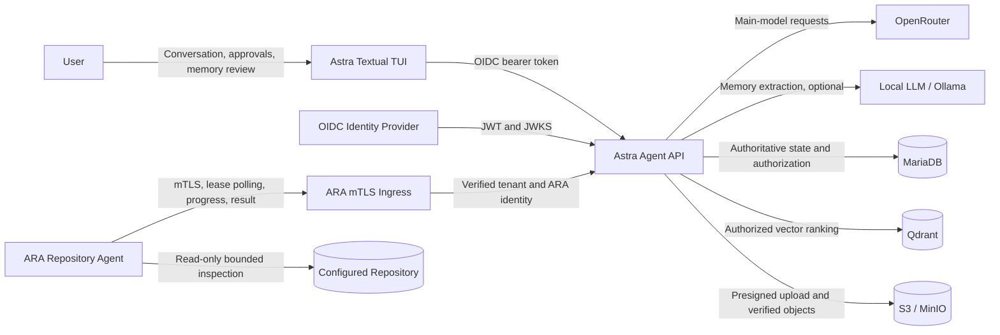
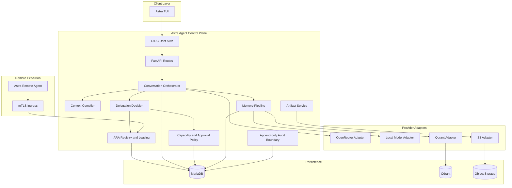
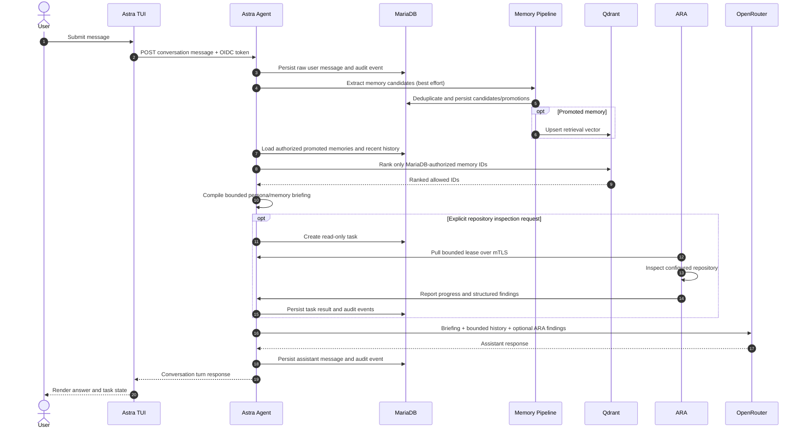
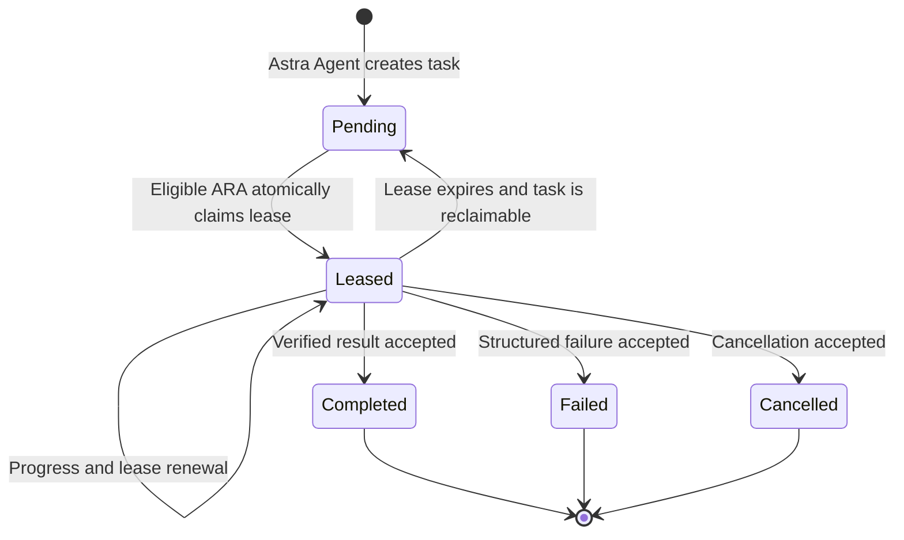
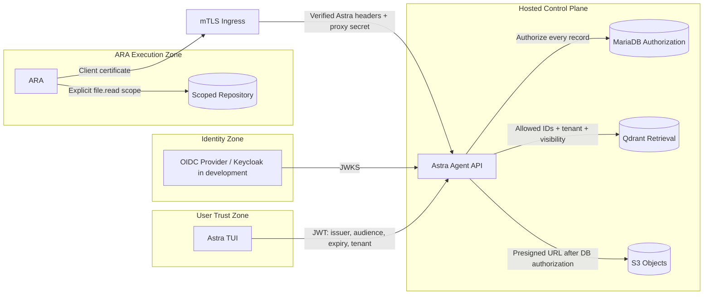
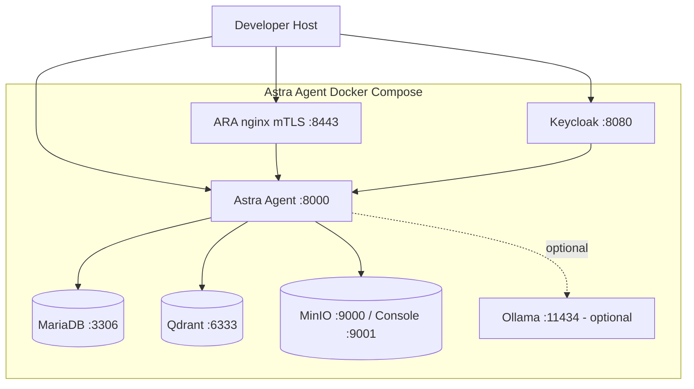

# Astra Agent High-Level Design

## Purpose

Astra Agent is a hosted, multi-tenant Distributed Enriched-Persona Agent (D.E.P.A.). It combines
a user-facing conversational control plane with independently authenticated Astra Remote Agents
(ARA). Astra Agent owns durable state, policy decisions, context assembly, delegation, and audit;
an ARA receives only a bounded task and explicit capabilities.

## Design Principles

- MariaDB is authoritative for durable state and authorization.
- Persona and memory context are compiled, not accumulated into an unbounded prompt.
- ARA delegation is task-scoped, capability-scoped, tenant-scoped, and lease-bound.
- Impactful actions are default-deny or approval-gated.
- Raw user input is persisted before optional model, memory, vector, or ARA work.
- Qdrant ranks authorized memories but never decides authorization.
- MinIO/S3 stores bytes; MariaDB owns artifact metadata and access decisions.
- Important transitions append audit events.

## System Context

## Runtime Components

## Conversation Flow

The current conversation route persists the user message first, runs best-effort memory
processing, compiles bounded context, optionally delegates repository inspection, invokes the
main model, and persists the assistant response.

### Current behavior

- **Implemented**: raw user message persistence precedes optional processing.
- **Implemented**: recent history is bounded by configuration.
- **Implemented**: explicit repository inspection language triggers read-only ARA delegation.
- **Implemented**: completed ARA findings are supplied to the model for synthesis.
- **Partial**: delegation planning is deterministic keyword matching, not a general typed planner.
- **Partial**: memory processing is best-effort in the request path, not yet a durable background
  queue.

## ARA Delegation And Leasing

An ARA is eligible only when tenant ownership and required capabilities match. Every progress,
renewal, approval, artifact, and completion operation validates tenant ID, ARA ID, task ID, lease
ID, task state, and lease expiry within the persistence boundary.

The implemented repository ARA:

- Reads only under an explicitly configured repository root.
- Ignores symlink escapes, large files, binary files, VCS data, dependencies, and build output.
- Executes no commands and uses no network tools.
- Returns repository inventory plus file and line evidence.

## Security And Trust Boundaries

Trust rules:

- User JWTs are signature, issuer, audience, expiry, subject, and tenant validated.
- ARA certificates encode tenant ID in `OU` and ARA ID in `CN`; nginx validates the certificate
  and forwards identity through protected headers.
- Astra Agent must not be network-reachable around the mTLS ingress in production.
- Direct development headers are explicitly non-production.
- Artifact completion verifies tenant/task key prefix, existence, size, media type, and SHA-256
  metadata.

## Secure Local Deployment

The bundled Keycloak account, generated CA, and development secrets are demo assets. Production
requires managed identity, managed PKI, secret rotation, HTTPS for user traffic, network policy,
backups, monitoring, and restore testing.

## Failure Behavior

| Dependency | Current behavior |
|---|---|
| MariaDB | Authoritative dependency; durable routes cannot proceed safely without it. |
| OpenRouter | Model failure is audited and returned as a provider failure; raw user input remains. |
| Local model | Extraction falls back to conservative deterministic rules. |
| Qdrant | Memory processing is best effort; lexical fallback is available for context ranking. |
| MinIO/S3 | Artifact upload/download operations fail; conversation without artifacts remains usable. |
| ARA unavailable | Delegated task remains pending and is visible in task progress. |
| ARA lease expires | Task becomes reclaimable by an eligible ARA. |

## Planned Evolution

The next architecture milestone introduces durable background jobs for memory extraction and
vector synchronization, ARA heartbeat/offline state and cancellation observation, authenticated
artifact downloads, richer typed planning, metrics, and production operations. See
[`../prompt.md`](../prompt.md) for the active continuation brief.
