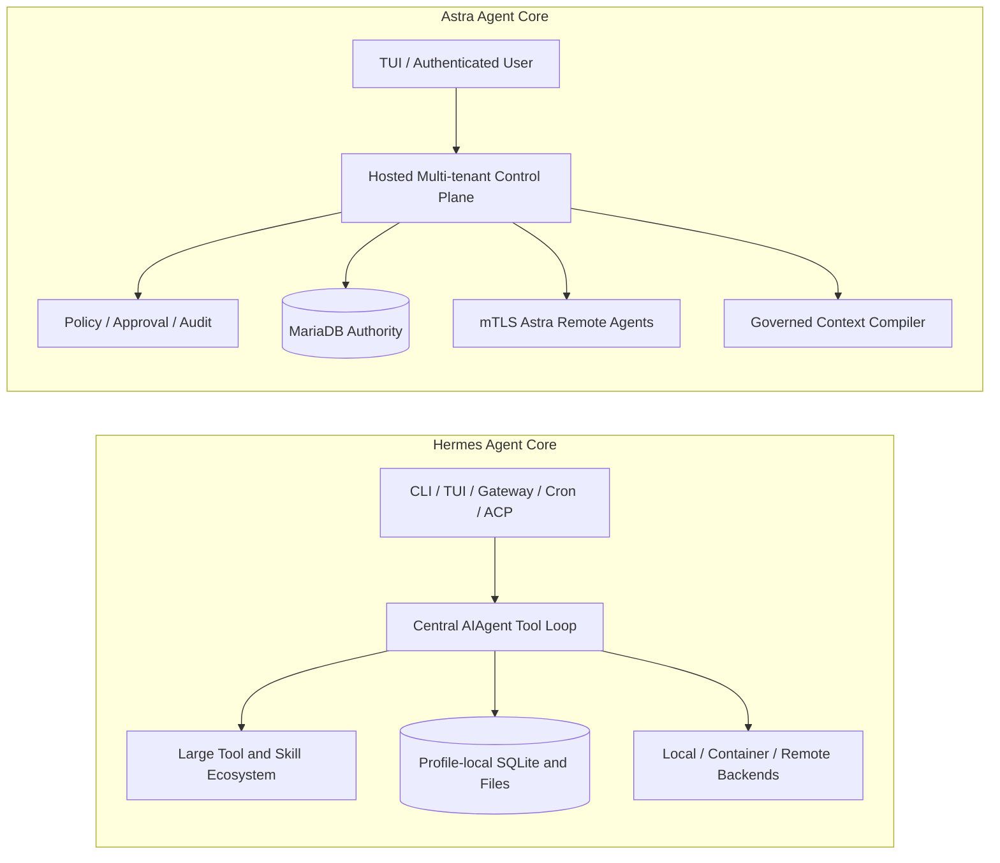
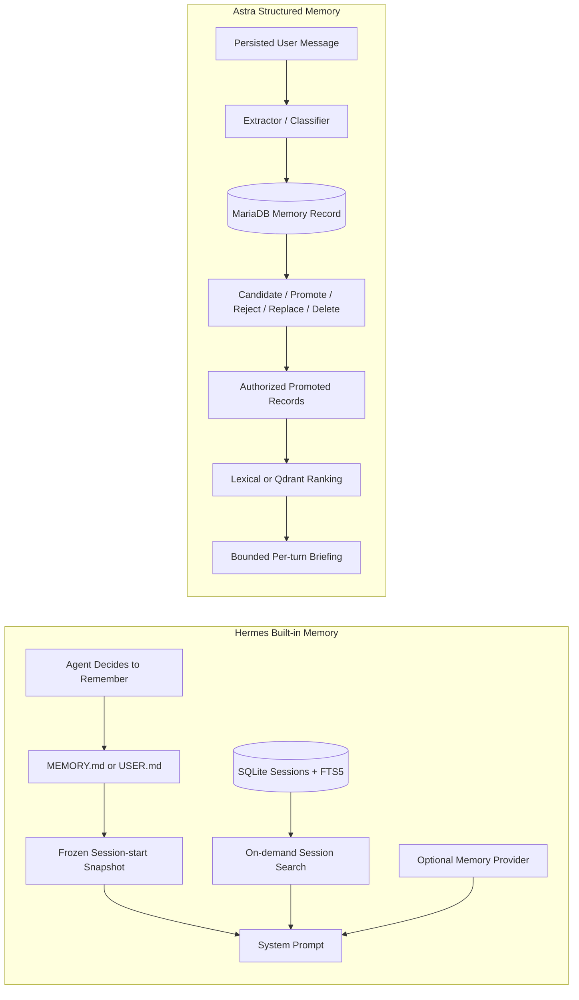
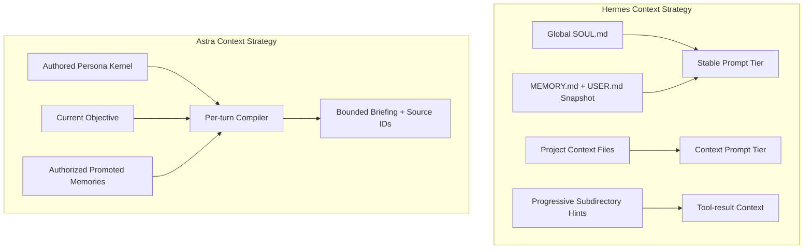

# Astra Agent Compared With Hermes Agent

## Scope And Sources

This document compares Astra Agent with [Hermes Agent](https://github.com/NousResearch/hermes-agent)
by Nous Research, focusing on what each system is at its core and how each handles memory.

The products optimize for different use cases. This is not a benchmark and does not claim that
one is universally superior.

Hermes behavior is based on its public documentation accessed **2026-08-01**:

- [Hermes Agent repository and README](https://github.com/NousResearch/hermes-agent)
- [Hermes architecture](https://hermes-agent.nousresearch.com/docs/developer-guide/architecture)
- [Hermes persistent memory](https://hermes-agent.nousresearch.com/docs/user-guide/features/memory)
- [Hermes context files](https://hermes-agent.nousresearch.com/docs/user-guide/features/context-files)
- [Hermes security](https://hermes-agent.nousresearch.com/docs/user-guide/security)
- [Hermes skills](https://hermes-agent.nousresearch.com/docs/user-guide/features/skills)

Hermes evolves quickly; re-check those sources before using this comparison for a product or
security decision. Astra Agent behavior is based on this repository and its passing tests.

## Executive Summary

**Hermes Agent** is primarily a broad, local-first general tool agent. A central `AIAgent` loop
serves its CLI, TUI, messaging gateway, cron, ACP, API, and batch workflows. It emphasizes model
choice, tools, skills, channels, terminal backends, automation, subagents, and a closed learning
loop that can update memory and procedural skills.

**Astra Agent** is primarily a hosted, multi-tenant control plane for a Distributed
Enriched-Persona Agent (D.E.P.A.). It emphasizes durable tenant boundaries, governed structured
memory, compact context compilation, explicit policy and approvals, append-only audit, and remote
execution through independently authenticated Astra Remote Agents (ARA).

The shortest useful distinction is:

> Hermes centers the capable agent loop. Astra centers the governed control plane and enriched
> persona across distributed execution.

## What Each Product Is At Its Core

### Hermes Agent

Hermes documentation describes one platform-agnostic `AIAgent` class as its core conversation
and tool loop. Entry points adapt that loop to different surfaces.

Its center of gravity is breadth and extensibility:

- Multiple model providers and API modes.
- A large registry of tools and toolsets.
- CLI, TUI, desktop, messaging gateway, ACP, API, and batch entry points.
- Many messaging platform adapters.
- Cron and unattended automations.
- Local, Docker, SSH, Singularity, Modal, Daytona, and Vercel Sandbox execution backends.
- Subagents and parallel workstreams.
- MCP, plugins, memory providers, context engines, and agent-managed skills.
- SQLite session persistence with FTS5 search.

Hermes profiles isolate configuration, memories, sessions, and processes on a per-profile basis.
It is designed to live near the user or in a user-controlled runtime and to expose a large set of
agent capabilities across many surfaces.

### Astra Agent

Astra Agent's center of gravity is durable governance across tenants and remote execution nodes:

- A hosted FastAPI control plane owns conversations, tasks, leases, approvals, memories,
  artifacts, persona context, and audit state.
- MariaDB is the canonical persistence and authorization source.
- OIDC authenticates users and carries tenant identity.
- mTLS authenticates each ARA independently.
- ARA work is bounded by tenant, task packet, capability, scope, lease, and deadline.
- Qdrant can rank only memory IDs already authorized by MariaDB.
- S3/MinIO stores artifact bytes while MariaDB governs ownership and lifecycle.
- OpenRouter provides main-model conversation and synthesis.
- A local model can extract/classify memory without becoming the main reasoning provider.
- The Textual TUI is the sole current user channel.

Astra Agent is deliberately narrower. It currently has one concrete read-only repository ARA,
one main-model provider boundary, no broad plugin marketplace, no scheduler, and no multi-channel
gateway.

## Architectural Comparison

| Dimension | Hermes Agent | Astra Agent |
|---|---|---|
| Primary shape | General agent runtime centered on one tool loop | Hosted multi-tenant control plane plus remote ARAs |
| Typical ownership | Local/user profile or user-controlled deployment | Hosted tenant context with centralized authority |
| User surfaces | CLI, TUI, desktop, many messaging channels, ACP, API | Textual TUI and FastAPI today |
| Model strategy | Many providers and runtime switching | OpenRouter main model; optional local memory model |
| Tool strategy | Large in-process registry, plugins, MCP, skills | Explicit bounded ARA capabilities; intentionally narrow |
| Execution | Local and multiple container/cloud/SSH backends; subagents | mTLS ARAs pulling task leases from hosted control plane |
| Durable state | Profile files plus SQLite session/state DB | MariaDB tenant-owned domain records and events |
| Authorization unit | Profile/session/platform/tool/backend rules | Tenant + actor + ARA + capability + task + lease + approval |
| Audit shape | Session/tool observability and stored execution history | Append-only domain events for important state transitions |
| Scheduling | Built-in cron | Explicitly out of MVP scope |
| Extensibility | Broad tools, plugins, skills, channels, memory providers | Typed package/provider/ARA boundaries, fewer implementations |
| Main optimization | Breadth, autonomy, local usability, learning procedures | Governance, provenance, tenant isolation, bounded delegation |

## Execution And Delegation

```mermaid
flowchart TB
    subgraph H[Hermes]
        HR[Request] --> HL[AIAgent Loop]
        HL --> HT[Tool / Skill / MCP / Subagent]
        HT --> HB[Selected Local or Remote Backend]
        HB --> HO[Observed Tool Result]
        HO --> HL
    end

    subgraph A[Astra]
        AR[Request] --> AC[Hosted Coordinator]
        AC --> AP[Policy and Capability Validation]
        AP --> AT[Durable Tenant-scoped Task]
        AT --> AL[Bounded Lease]
        AL --> AA[mTLS ARA]
        AA --> AE[Structured Evidence / Artifact]
        AE --> AS[Hosted Synthesis]
    end
```

Hermes has a much broader execution ecosystem today. Its terminal backends and tool registry can
handle many workflows that Astra Agent cannot yet perform.

Astra's distinction is that a remote executor is a first-class identity and policy subject, not
just a tool backend. The control plane validates the ARA identity, tenant, capability, task,
lease, expiry, approval state, result, and artifact metadata. This is useful when execution nodes
are independently operated or physically separated from the hosted agent.

## Memory: The Most Important Difference

Hermes and Astra both reject unlimited transcript injection and both aim for curated,
cross-session memory. Their storage and governance models differ substantially.

### Hermes built-in memory

Hermes documents two bounded files under its profile home:

- `MEMORY.md`: agent notes about environment, projects, conventions, lessons, and completed work.
- `USER.md`: user identity, preferences, communication style, and expectations.

Their documented defaults total roughly 1,300 tokens. They are loaded as a **frozen snapshot at
session start**, which preserves prompt-cache stability. Writes persist immediately but become
part of the system prompt on the next session.

The agent uses a `memory` tool to add, replace, and remove entries. It proactively decides what
to save. Capacity is hard-bounded; the agent must consolidate or remove entries before an
overflowing write can succeed. Exact duplicates are rejected, and writes are scanned for
injection/exfiltration patterns.

Hermes also has a separate recall plane:

- All sessions are stored in SQLite.
- FTS5 session search retrieves exact past messages on demand.
- Optional external memory providers add semantic search, user modeling, graphs, or extraction.
- Its documented providers include Honcho, OpenViking, Mem0, Hindsight, Holographic, RetainDB,
  ByteRover, and Supermemory.
- A background self-improvement review can update memory and procedural skills.
- Optional approval gates stage memory or skill writes for explicit review.

### Astra memory

Astra stores each memory as an individual tenant-owned MariaDB record with:

- Kind: fact, preference, project, decision, or commitment.
- Source message and source audit event.
- Confidence and confirmation state.
- Candidate, promoted, rejected, or deleted lifecycle state.
- Sensitivity, visibility, and retention metadata.
- Reviewer identity and review time.
- Contradiction/replacement link.

Each user turn is first persisted as a raw message. An extractor creates structured candidates.
Explicit high-confidence forms may be promoted immediately; weaker inferences remain candidates
and are excluded from context. Users can inspect why a memory exists, promote or reject it,
replace a contradictory memory atomically, or soft-delete it.

At each turn, Astra loads promoted, non-deleted records authorized by MariaDB. Qdrant may rank
them, but Astra intersects every result with that authorized record map before context assembly.
The selected records are compiled into a bounded per-turn briefing with source memory IDs in the
audit event.

### Memory comparison

| Concern | Hermes Agent | Astra Agent |
|---|---|---|
| Built-in canonical form | Two bounded curated text files | Individual structured MariaDB records |
| Ownership boundary | Local profile | Tenant-owned hosted records |
| Main categories | Agent notes and user profile | Fact, preference, project, decision, commitment |
| Write decision | Agent memory tool and background review | Extractor classification plus explicit lifecycle |
| Approval | Optional global write-approval gate | Candidate review per record; high-confidence promotion policy |
| Provenance | Entry and learning journey context; session history separate | Required source message/event on every record |
| Review operations | Add, substring replace, remove; pending approve/reject when gate enabled | Promote, reject, contradiction replacement, delete |
| Capacity | Strict character limits for always-injected memory | Record limit and token budget at retrieval time |
| Prompt timing | Frozen snapshot at session start | Recompiled relevant briefing per turn |
| Session recall | SQLite FTS5 search over all sessions | Recent bounded history; broad transcript search not implemented |
| Semantic extension | Multiple optional memory-provider plugins | Qdrant ranking subordinate to MariaDB authorization |
| Procedural memory | Agent-managed skills | Not implemented; ARAs are code-defined capabilities |
| Security scanning | Memory/context injection scanning documented | Structured validation and authorization; comparable injection scanner not implemented |
| Multi-tenancy | Profile isolation | First-class `tenant_id` on every durable record |

## Memory Trade-offs

### Where Hermes is stronger today

- Mature proactive memory behavior and background self-improvement.
- Very simple, visible, editable built-in memory files.
- Fast FTS5 search across unlimited session history.
- Procedural memory through agent-created and self-improving skills.
- Multiple external semantic/user-model memory providers.
- Prompt injection scanning before memory and context-file injection.
- Frozen session memory favors prompt caching and predictable within-session context.
- A polished learning journey for viewing and pruning learned memory and skills.

### Where Astra's core model is stronger for its target

- First-class tenant isolation at the record and query level.
- Mandatory source event and source message provenance.
- Explicit lifecycle state for each inferred memory.
- Atomic contradiction replacement rather than free-text editing alone.
- Reviewer identity and timestamps on curated changes.
- MariaDB remains authoritative even when vectors are stale or malicious.
- Deleted memories stop authorizing immediately without waiting for Qdrant cleanup.
- Different memories can have sensitivity, visibility, retention, and confidence metadata.
- Per-turn retrieval avoids injecting the entire persistent memory set on every request.

### Where Astra must improve

- Move extraction/vector work behind the planned durable asynchronous queue.
- Add production-quality embeddings and versioned re-embedding.
- Add transcript/session search comparable to Hermes FTS5 search.
- Add injection and secret scanning for extracted memories before promotion.
- Improve freshness, retention enforcement, contradiction detection, and curation UX.
- Add a procedural-memory equivalent only if it can preserve review, provenance, and policy.
- Measure retrieval precision and user rejection/deletion rates.

## Persona And Context

Hermes uses a global `SOUL.md` for personality and discovers project context files such as
`.hermes.md`, `AGENTS.md`, and `CLAUDE.md`. It progressively discovers subdirectory context during
tool use, scans context for prompt injection, and structures prompt tiers for caching. Built-in
memory is frozen at session start.

Astra models persona as a structured authored core plus learned adaptation in its domain model.
The current implementation uses a stable configured persona kernel and compiles a bounded
per-turn briefing from that kernel, the current objective, and relevant promoted memories.
Project-context file discovery and persona administration are not yet as developed as Hermes.

## Security Posture Comparison

Hermes documents broad defense in depth for an agent with powerful tools: dangerous-command
approval, a hard blocklist, user deny rules, file-write protection, optional safe roots, multiple
sandbox backends, credential filtering, SSRF controls, gateway allowlists/pairing, context-file
scanning, skill scanning, and supply-chain advisories.

Astra currently minimizes the execution surface instead. Its concrete ARA has only read access
under one configured repository root and cannot execute commands or use network tools. Astra
also provides OIDC tenant identity, mTLS ARA identity, explicit capabilities, durable approvals,
leases, append-only audit, and centralized MariaDB authorization.

Hermes has far more mature safeguards for broad local tooling. Astra has a clearer hosted
identity and tenant model for independently authenticated remote executors. Astra will need
additional sandbox, egress, scanner, and credential-broker controls before broadening ARA
capabilities.

## Product Breadth And Maturity

Hermes is substantially broader today:

- Many tools, toolsets, models, providers, channels, plugins, and skills.
- Cron, voice/media, browser, MCP, ACP, desktop, web dashboard, and messaging gateways.
- Multiple execution environments and subagent delegation.
- Self-improving procedural skills and research trajectory generation.
- A polished installer, setup wizard, diagnostics, migration tooling, and extensive docs/tests.

Astra is intentionally an MVP with a narrower vertical slice:

- One TUI channel.
- OpenRouter as the main provider.
- One concrete read-only repository ARA.
- Deterministic explicit-request delegation.
- A smaller but strongly typed hosted domain and authorization model.

For a user wanting a capable personal agent today, Hermes offers much more functionality. For a
team designing a hosted multi-tenant persona agent with governed structured memory and remote
identity boundaries, Astra's architecture explores a different core.

## Choosing Between Them

### Choose Hermes when

- You want a mature personal/local agent now.
- You need many tools, messaging channels, providers, skills, MCP, cron, or browser workflows.
- You value local profile files and easy direct editing.
- You want session search, procedural skill learning, and external memory providers.
- You need broad terminal and sandbox backend support.

### Choose or continue building Astra when

- Hosted multi-tenancy is a primary requirement.
- Memory must be structured, record-level, provenance-backed, and individually governed.
- Remote execution nodes need independent mTLS identities and bounded leases.
- MariaDB must remain the central authorization and lifecycle authority.
- Auditability and approval state must be durable domain records.
- You prefer a narrow default-deny execution surface over broad built-in tooling.

### They can inform each other

Astra can learn from Hermes' session search, context-file scanning, progressive skill disclosure,
background learning review, execution backends, and operational polish. Hermes-like breadth
should not be copied into Astra without preserving tenant, capability, lease, provenance, and
approval invariants.

Hermes could conceptually benefit from Astra-style record-level provenance and hosted tenant
authorization in deployments that need centrally governed memory or independently authenticated
remote execution. That is an architectural observation, not a claim about Hermes' roadmap.

## Astra Roadmap In Light Of Hermes

```mermaid
flowchart LR
    Now[Astra Today] --> Reliability[Durable Async Memory Jobs]
    Reliability --> Search[Authorized Transcript Search]
    Search --> Safety[Memory Injection and Secret Scanning]
    Safety --> Planning[Typed Model-assisted Planning]
    Planning --> ARAHealth[ARA Health and Resilient Execution]
    ARAHealth --> Procedures[Governed Procedural Knowledge]
    Procedures --> Operations[Metrics, Backups, PKI, Cost Controls]
```

Priorities should be:

1. Finish the durable asynchronous memory boundary before adding more memory providers.
2. Add authorized transcript search without making raw history part of every prompt.
3. Add memory/context injection scanning before promotion and prompt inclusion.
4. Improve ARA heartbeat, cancellation, renewal, retry, and failure visibility.
5. Replace keyword delegation with typed plans validated by policy.
6. Introduce governed procedural knowledge only with provenance and review.
7. Add channels and tools later, without weakening default-deny capabilities.

## Bottom Line

Hermes Agent is currently the more complete general-purpose agent. Its core is a broad agent/tool
runtime with local profiles, many surfaces, curated prompt memory, session search, and a rich
learning/skills ecosystem.

Astra Agent's core is different: a hosted D.E.P.A. control plane with structured persona and
memory governance, tenant-owned durable records, centralized authorization, explicit approvals,
and mTLS remote agents operating through bounded leases.

Astra should not try to beat Hermes by rapidly matching feature count. Its credible path is to
be better at **governed memory, explainable durable context, tenant isolation, and distributed
execution accountability**. Hermes provides a useful benchmark for the usability, recall,
security hardening, and learning capabilities Astra still needs to earn that position.
