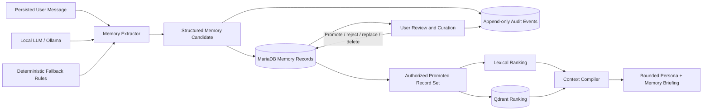
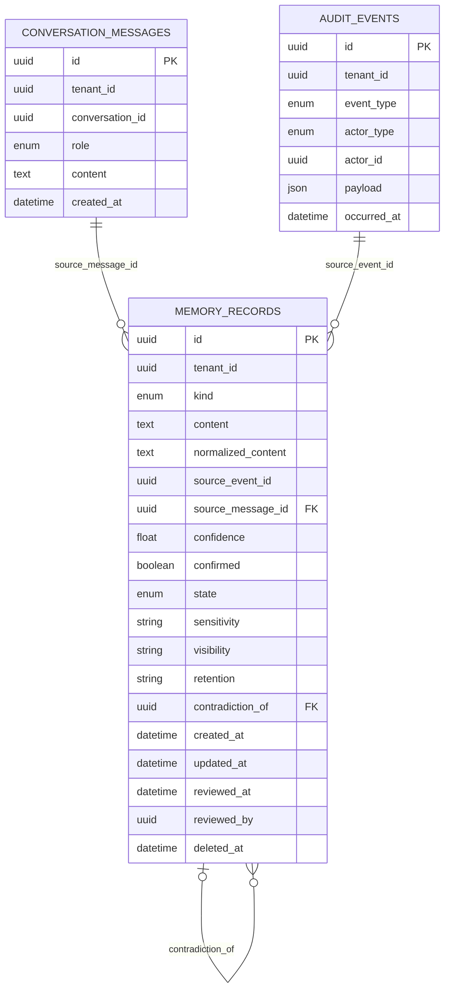
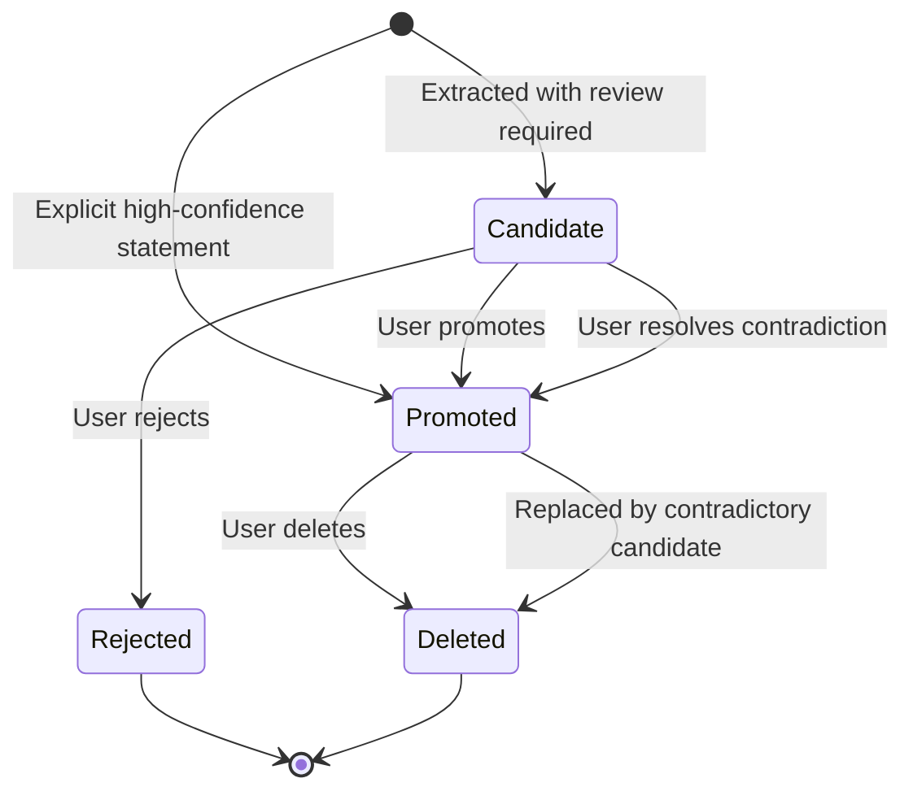
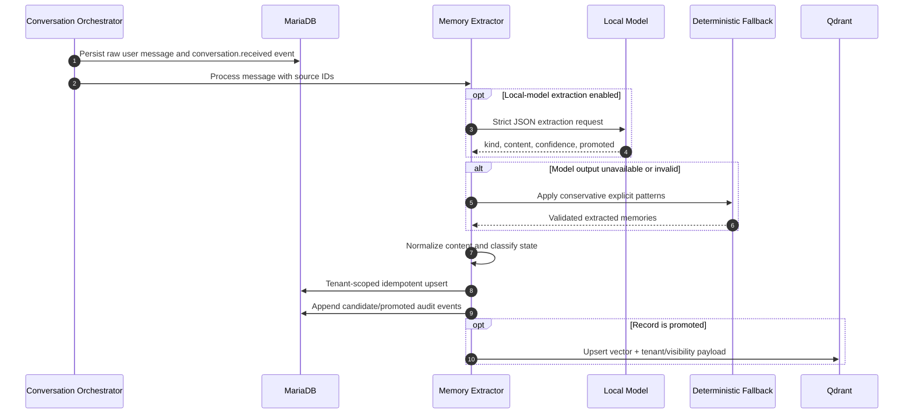
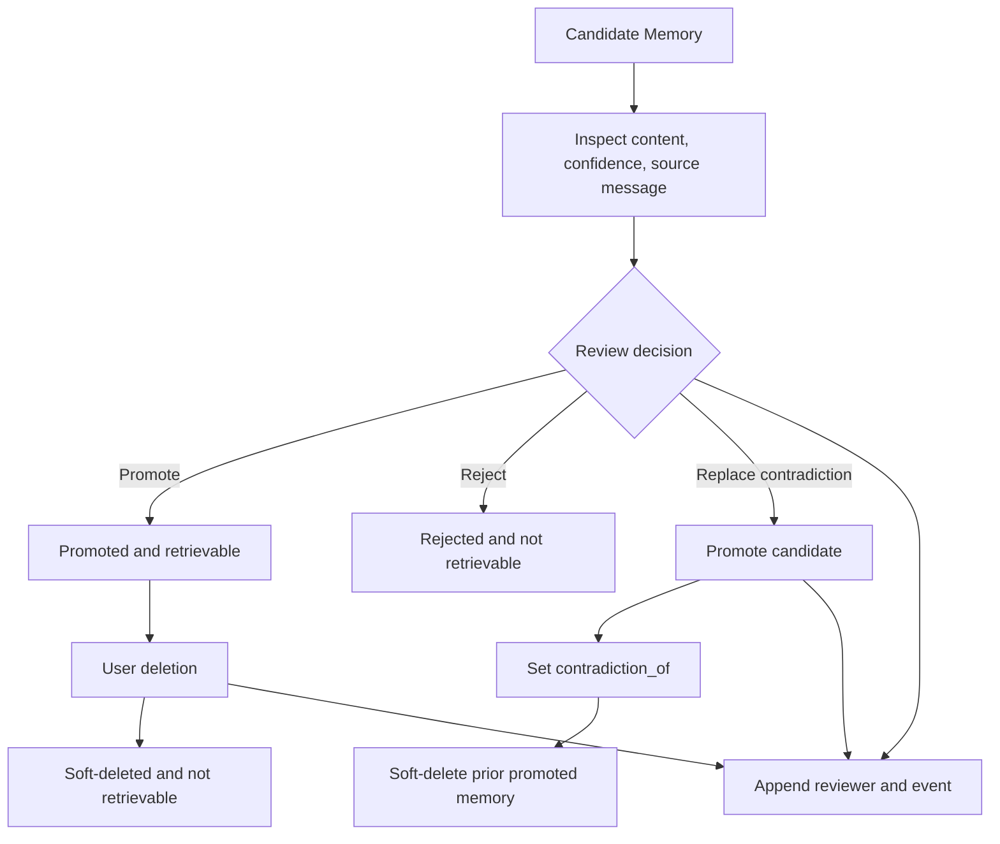
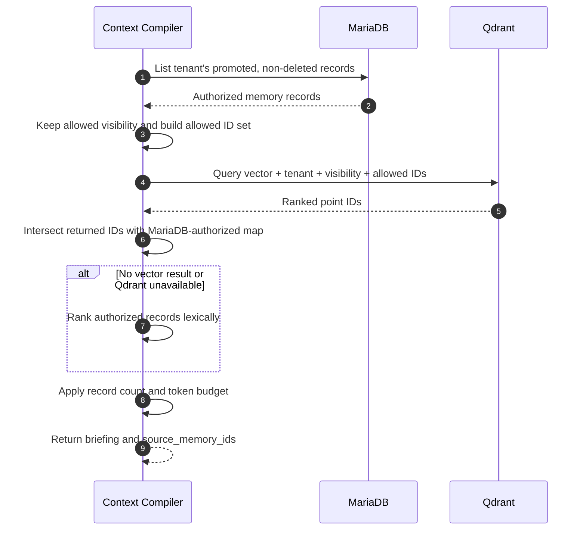
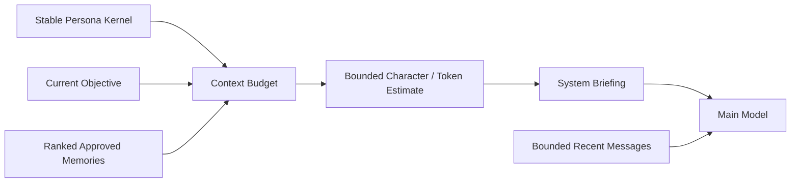
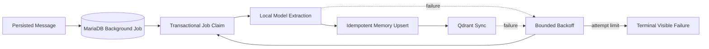

# Astra Agent Memory High-Level Design

## Goals

Astra Agent memory is designed to provide useful, compact, user-controlled context without
turning the entire conversation history into a prompt. A durable memory must be inspectable,
traceable to its source, reviewable, reversible, tenant-isolated, and subordinate to the authored
persona core.

Memory is not a single vector database. It is a service boundary over:

- Raw conversation and audit history in MariaDB.
- Structured memory records in MariaDB.
- Lexical ranking over authorized structured records.
- Optional semantic ranking in Qdrant.
- A local extraction/classification model with deterministic fallback.

## Memory System Context

## Authoritative Data Model

MariaDB stores each `MemoryRecord`. Qdrant stores only a retrieval vector and minimal filtering
metadata; it is not the canonical record.

### Memory kinds

- `fact`: durable factual information explicitly supplied by the user.
- `preference`: communication or workflow preferences.
- `project`: project identity and context.
- `decision`: prior decisions that should constrain future work.
- `commitment`: promises, obligations, or expected follow-up.

### Lifecycle states

Only `PROMOTED` and non-deleted records are eligible for context retrieval. Candidates are
inspectable but excluded. Rejected and deleted records remain represented in durable history and
audit, but are not returned by normal memory listing or retrieval.

## Extraction And Initial Classification

### Current extraction policy

**Implemented deterministic fallback** recognizes conservative explicit forms:

- `remember that ...` creates a promoted fact.
- `I prefer ...` creates a promoted preference.
- `my project is ...` creates promoted project context.
- `I use ...` creates a candidate requiring review.

**Implemented local-model mode** asks an OpenAI-compatible endpoint for strict JSON records. The
result is validated by kind, content, confidence, and promotion flag. Invalid output falls back
to deterministic extraction.

### Deduplication

Content is case-folded and whitespace-normalized into `normalized_content`. MariaDB enforces a
tenant-scoped unique constraint over `(tenant_id, normalized_content)`.

- Repeated active content returns the existing record.
- A deleted record can be revived using the same normalized key and new provenance.
- Tenant A can never deduplicate against or discover tenant B's record.

## Review And Curation

Review operations are tenant-scoped and transactional in MariaDB:

- Only a `CANDIDATE` can be reviewed.
- Promotion sets `confirmed`, `reviewed_at`, and `reviewed_by`.
- Rejection records the reviewer and excludes the record from retrieval.
- Contradiction replacement locks both records, promotes the candidate, links
  `contradiction_of`, and soft-deletes the previous promoted record atomically.
- A repeated or cross-tenant review fails rather than silently changing state.

The TUI currently shows recent memories and provides promote/reject controls for the first
pending candidate. The API also supports explicit contradiction replacement and provenance
explanation.

## Retrieval And Authorization

Retrieval follows an authorization-first design.

### Why MariaDB authorization comes first

Qdrant payload filters are defense in depth, not authorization. A compromised, stale, or
misconfigured vector index could return arbitrary point IDs. Astra Agent therefore:

1. Loads promoted records for the tenant from MariaDB.
2. Builds an allowed ID map.
3. Sends tenant, visibility, and allowed IDs to Qdrant.
4. Discards every returned ID not already present in the allowed map.

This invariant is covered by a malicious-vector-result test.

## Context Compilation

The compiled system briefing includes:

- Stable persona rules.
- Relevant promoted memories with memory kind.
- The current objective.
- Source memory IDs in the audit event for explainability.

Raw historical transcripts are not inserted into the briefing. A separately bounded recent
conversation window is sent to the main model.

## Deletion Semantics

Deletion is soft in MariaDB and best-effort in Qdrant:

1. Lock and validate the tenant-owned memory record.
2. Set state `DELETED`, `deleted_at`, and `updated_at`.
3. Append `memory.deleted` with the user actor.
4. Request Qdrant point deletion.
5. Exclude the memory immediately because MariaDB no longer authorizes it, even if Qdrant point
   deletion fails.

This ordering prevents stale vectors from re-authorizing deleted memory.

## Audit Events

Memory behavior produces append-only events:

- `memory.candidate_created`
- `memory.promoted`
- `memory.rejected`
- `memory.contradiction_resolved`
- `memory.deleted`
- `context.compiled` with included source memory IDs

Together with `source_event_id`, `source_message_id`, reviewer fields, and contradiction links,
these events answer: “Why do you remember this?”

## Current Limitations

- **Partial**: extraction runs best-effort during the conversation request. Exceptions are
  suppressed after the raw message is durable, but slow extraction can still add latency.
- **Partial**: deterministic embeddings are useful for integration and authorization testing,
  not high-quality production semantic retrieval.
- **Partial**: the TUI review panel is intentionally minimal.
- **Planned**: durable asynchronous extraction/vector jobs with retries and queue visibility.
- **Planned**: stronger sensitivity classifiers, retention enforcement, freshness decay, and
  richer contradiction detection.
- **Planned**: re-embedding/version migration and Qdrant reconciliation jobs.

## Planned Asynchronous Boundary

The next milestone moves optional memory work behind this durable boundary so conversation
latency and availability do not depend on the local model or Qdrant. See [`../prompt.md`](../prompt.md).
