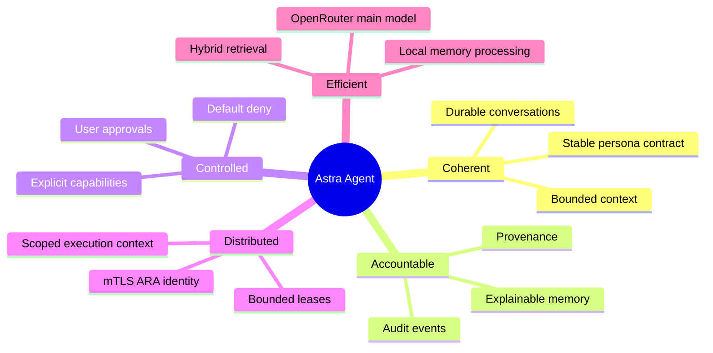
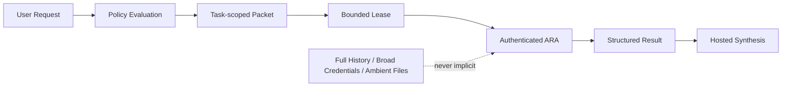

# Why Astra Agent

## Positioning

Astra Agent is not intended to be “better” because it has more tools, more autonomy, or a larger
prompt. Its design aims to be better for users who need a coherent long-running agent with
controlled memory, remote execution boundaries, tenant isolation, and evidence about why an
action or answer occurred.

The useful comparison is against common architectural patterns, not individual products whose
features and implementations change frequently.

For a sourced comparison with one concrete product, see
[`astra-vs-hermes.md`](astra-vs-hermes.md).

## The Core Thesis

Astra Agent separates five concerns that are often collapsed together:

1. Persona: how the agent should behave.
2. Memory: what durable user context it may recall.
3. Conversation: what the user is currently asking.
4. Delegation: what bounded work an ARA may execute.
5. Policy: what actions are allowed and who approved them.

That separation is the source of most current and planned advantages.

## Current Advantages

### 1. Memory is a governed record, not an opaque vector

Common pattern:

Astra Agent pattern:

Current benefits:

- Every memory has source message and event provenance.
- Users can inspect, promote, reject, replace, and delete memory.
- Candidates are excluded until approved or explicitly high-confidence.
- Deleted records are immediately unauthorized even if a vector remains stale.
- Contradictions can replace prior records atomically instead of silently coexisting.

### 2. Remote execution is a security boundary

Many agent designs treat tools as in-process functions with ambient access. Astra Agent treats
remote execution as a separate authenticated system.

Current benefits:

- ARA identity is tied to an mTLS certificate.
- Tenant and ARA identity are validated on every lease-bound operation.
- Capabilities and scopes are explicit.
- Leases expire and work can be reclaimed.
- The implemented repository ARA is read-only and cannot escape its configured root.
- ARA findings include file and line evidence before model synthesis.

### 3. MariaDB is the authorization authority

Specialized systems remain subordinate:

- Qdrant cannot authorize a memory.
- MinIO cannot authorize an artifact.
- An ARA cannot authorize its own capability.
- OpenRouter cannot mutate durable state directly.

This creates one durable place to reason about tenant ownership and lifecycle state.

### 4. Important behavior is inspectable

Append-only events cover conversation receipt, context compilation, model requests and failures,
task creation and leasing, ARA progress, approvals, artifacts, and memory transitions.

This does not automatically make every model decision explainable, but it makes system actions
and data provenance inspectable in a way that prompt-only architectures cannot.

### 5. Failure does not erase the user's input

The user message is persisted before memory extraction, vector synchronization, delegation, or
main-model invocation. If optional processing fails, the raw event remains available for retry,
inspection, or future recovery.

### 6. Expensive reasoning and cheap processing are separated

The architecture reserves OpenRouter for conversation, planning, and synthesis. Local models can
perform memory extraction and classification. This creates a path to lower cost and better data
locality without constraining the main model to local hardware.

## Comparison By Architectural Pattern

| Concern | Prompt-centric agent | Tool-centric agent | Vector-memory chatbot | Astra Agent today |
|---|---|---|---|---|
| Persona | Large mutable prompt | Usually tool-independent | Usually prompt text | Structured stable kernel |
| Durable memory | Transcript/history | Often external or absent | Nearest chunks | Structured records + provenance |
| Memory control | Delete history | Product-specific | Often coarse | Inspect, review, replace, delete |
| Retrieval authorization | Application-dependent | Application-dependent | Often vector filters | MariaDB authority + vector intersection |
| Remote execution | Often ambient process | Tool runtime | Usually none | mTLS ARA + capabilities + lease |
| Approvals | Prompt convention | Framework-dependent | Usually none | Durable policy and approval state |
| Audit | Logs | Tool logs | Chat history | Append-only domain events |
| Failure recovery | Retry whole prompt | Tool-specific | Retry query | Raw input durable; queue planned |
| Context cost | Grows with history | Varies | Chunk injection | Bounded compiled briefing |

This table compares patterns, not every implementation using those patterns. A well-designed
system in another category may implement many of the same safeguards.

## Where Astra Agent Is Not Better Yet

The current MVP has meaningful boundaries, but it is not broadly superior today.

- Delegation planning is keyword-based for explicit repository inspection requests.
- Only one concrete read-only repository ARA exists.
- Memory extraction is still synchronous best effort within the request path.
- Deterministic embeddings are integration-quality, not production semantic embeddings.
- The TUI is functional but operationally minimal.
- There is no durable background queue, queue dashboard, or automatic vector reconciliation.
- There is no multi-ARA parallel planning or general task decomposition.
- Production identity, PKI, networking, backups, and observability are deployment work.
- The main model is not independently benchmarked for answer quality, latency, or cost.

These are constraints to resolve, not claims to hide.

## How Astra Agent Can Become Better

### Reliability flywheel

Planned advantages:

- Conversation latency independent of local-model and Qdrant availability.
- Idempotent extraction and vector synchronization after restart.
- Visible retry and terminal-failure state.
- Versioned extractors and embeddings that can be reprocessed safely.

### Delegation quality flywheel

Planned advantages:

- Model-assisted planning constrained by typed contracts.
- ARA selection by capability, trust, health, availability, and cost.
- Bounded parallel sibling tasks without recursive delegation.
- Partial-failure synthesis that identifies missing evidence.
- Provenance links from final claims to ARA result and artifacts.

### Trust and operations flywheel

Planned improvements:

- Managed PKI, certificate rotation, and revocation.
- External OIDC administration and HTTPS everywhere.
- Correlation IDs across conversation, task, lease, ARA, model, artifact, and job.
- Service readiness, queue lag, model cost, latency, and failure metrics.
- Backup/restore drills and retention enforcement.
- Network isolation that makes ingress bypass impossible.

## Differentiation That Should Be Measured

Astra Agent should prove improvement with metrics, not adjectives.

| Hypothesis | Example measure |
|---|---|
| Compiled context reduces model cost | Input tokens per successful task versus full-history baseline |
| Curated memory improves relevance | Precision of recalled memories and user deletion/rejection rate |
| ARA boundaries reduce risk | Unauthorized capability and cross-tenant test pass rate |
| Evidence improves answer trust | Percentage of repo claims linked to file/line evidence |
| Durable jobs improve recovery | Recovery rate after local-model/Qdrant outage and restart |
| Local processing lowers cost | Memory-processing cost per conversation |
| Stable persona improves coherence | User-rated consistency across sessions |
| Approvals improve control | Impactful actions attempted without a valid approval: target zero |

## Product Promise

The credible Astra Agent promise is:

> A coherent agent that remembers with provenance, delegates through explicit trust boundaries,
> and lets users inspect why durable context and consequential actions exist.

The roadmap should deepen that promise rather than expand into unrelated channels, plugins, or
unbounded autonomy. Current implementation details are described in
[`architecture.md`](architecture.md) and [`memory.md`](memory.md); planned engineering priorities
are maintained in [`../prompt.md`](../prompt.md).
